# RAG Obsidian

A simple, fast RAG system for Obsidian vaults using RDBMS for exact matching and LLM for query parsing.

## 🚀 Quick Start

### 1. Setup (5 minutes)
```bash
# Install dependencies
pip install -r requirements.txt

# Install Ollama and pull model
ollama pull llama3.2:3b

# Update config.yaml with Obsidian Vault path
```

### 2. Try it out!

**Interactive Search:**
This is to search and ask questions about content in your vault.
```bash
python main.py rag

# Sample queries to try:
>>> "What did I do in January 2025?"
>>> "Find documents tagged work" 
>>> "Notes about machine learning"
>>> "What do I know about Python?"
```

**Enhance Your Documents:**
This is to enhance the existing documents with info on `tags`, `title`, `description`, and `created`
```bash
# Add AI-generated frontmatter to 5 files (test)
python main.py enrich --max-files 5

# Process all documents with 8 parallel workers
python main.py enrich --max-workers 8
```

### 3. Expected Output

**Search Example:**
```
Question: what do I know about K8s?
📝 Found 3 documents about Kubernetes cluster setup, pod management, and deployment strategies...
```

**Enrichment Example:**
```yaml
---
created: '2025-01-15'
description: Notes on Kubernetes cluster configuration and container orchestration
tags:
- kubernetes
- k8s
- containers
- devops
- orchestration
title: Kubernetes Cluster Setup Guide
---
```

## 🚀 Features

### Search Capabilities
- **Date Queries**: "What did I do in January 2025?" → finds files by dates
- **Tag Search**: "documents tagged work" → searches YAML frontmatter and hashtags  
- **Content Search**: "thoughts about AI" → searches note contents with keyword matching
- **Smart Parsing**: LLM extracts dates, tags, filenames from natural language
- **Fast Performance**: SQLite for exact matching + fallback content search

### Document Enhancement
- **LLM-Generated Frontmatter**: Automatically adds YAML metadata to documents
- **Smart Tagging**: AI-generated relevant tags based on content analysis
- **Title Generation**: Creates meaningful titles from document content
- **Description Creation**: Generates concise summaries of document content
- **Parallel Processing**: Multi-threaded processing for faster enrichment (4x+ speedup) with progress bars
- **Batch Processing**: Process entire vaults or individual files
- **Flexible Updates**: Preserve existing frontmatter or force updates

## 🛠️ Installation

### Prerequisites
- Python 3.8+
- [Ollama](https://ollama.ai) with `llama3.2:3b` model
- Obsidian vault

### Setup
  ```bash
  # Clone repository
  git clone [your-repo-url]
  cd obsidian-rag

# Create virtual environment
python -m venv venv
source venv/bin/activate  # Windows: venv\Scripts\activate

# Install dependencies
pip install -r requirements.txt

# Install Ollama model
ollama pull llama3.2:3b
```

### Configuration
See `config.yaml` and update if needed:
```yaml
paths:
  vault_path: "/path/to/your/obsidian/vault"  # ← Change this!
  metadata_db_path: "obsidian_metadata.db"

models:
  llm_model: "llama3.2:3b"
  llm_timeout: 120.0

search:
  max_rdbms_results: 50
  content_preview_length: 1000
```

## 🎯 Running

### RAG Search Mode
```bash
python main.py rag
```

Example queries:
- `"What did I do in January 2025?"` → Date-based search
- `"Find documents tagged work"` → Tag-based search  
- `"Notes about machine learning"` → Content search
- `"Files from Q3 2025"` → Date range search
- `"What is stripe"` → Content keyword search

### Document Enrichment Mode
```bash
# Enrich all documents with LLM-generated frontmatter (parallel by default)
python main.py enrich

# Test with limited files
python main.py enrich --max-files 5

# Force update existing frontmatter
python main.py enrich --force-update

# Configure parallel processing
python main.py enrich --max-workers 8  # Use 8 parallel workers
python main.py enrich --sequential     # Use sequential processing

# Enable debug logging
python main.py enrich --debug
```

### Command Help
```bash
# Show all available commands
python main.py --help

# Show options for specific commands
python main.py enrich --help
python main.py rag --help
```

The enrichment mode automatically adds YAML frontmatter to your Obsidian documents:
```yaml
---
created: '2025-01-15'
description: A brief LLM-generated description of the content
tags:
- llm-generated-tag1
- llm-generated-tag2
title: LLM-Generated Document Title
---
```

## 📁 Architecture

  ```
  obsidian-rag/
  ├── main.py                 # Entry point
├── config/
│   └── settings.py         # Configuration management
├── models/
│   ├── file_metadata.py    # Data structures
│   └── search_models.py    # Query/result models
├── database/
│   └── metadata_db.py      # SQLite operations
├── services/
│   ├── document_processor.py # YAML frontmatter extraction
│   ├── document_enricher.py  # LLM-powered document enhancement
│   ├── query_parser.py     # LLM query parsing
│   └── rag_service.py      # Main search service
├── config.yaml             # Configuration file
└── requirements.txt        # Dependencies
```

## 🔧 How It Works

### RAG Model & Data Flow

```mermaid
graph TD
    %% Data Sources
    A["Obsidian Vault<br/>(.md files)"] --> B[Document Processor]
    
    %% Document Processing Phase
    B --> C["YAML Frontmatter<br/>Parser"]
    B --> D["Hashtag<br/>Extractor"] 
    B --> E["Date<br/>Extractor"]
    B --> F["Content Preview<br/>Generator"]
    
    C --> G["Metadata<br/>Extraction"]
    D --> G
    E --> G
    F --> G
    
    G --> H[("SQLite Database<br/>Metadata Storage")]
    
    %% Query Processing Phase
    I["User Query<br/>'What did I do in Jan 2025?'"] --> J["LLM Query Parser<br/>llama3.2:3b"]
    J --> K["Structured Query<br/>dates: ['2025-01']<br/>tags: []<br/>filenames: []"]
    
    %% Search Phase
    K --> L[RDBMS Search Engine]
    H --> L
    L --> M["Exact Match Results<br/>• Date matches<br/>• Tag matches<br/>• Filename matches"]
    
    %% Response Generation Phase
    M --> N[Context Builder]
    N --> O["LLM Response Generator<br/>llama3.2:3b"]
    I --> O
    O --> P["Final Response<br/>Synthesized Answer"]
    
    %% Styling
    classDef userInput fill:#e1f5fe
    classDef processing fill:#f3e5f5
    classDef storage fill:#e8f5e8
    classDef llm fill:#fff3e0
    classDef output fill:#fce4ec
    
    class I userInput
    class B,C,D,E,F,G,L,N processing
    class H storage
    class J,O llm
    class P output
```



### Process Flow

**Phase 1: Document Processing (Indexing)**
1. **Document Ingestion**: Loads `.md` files from your Obsidian vault
2. **Metadata Extraction**: Parses YAML frontmatter, extracts hashtags, and identifies dates
3. **Database Storage**: Stores structured metadata in SQLite for fast exact matching
4. **Content Preview**: Creates searchable content previews for context building

**Phase 2: Query Processing (Understanding)**
1. **Natural Language Input**: User asks questions in plain English
2. **LLM Query Parsing**: `llama3.2:3b` extracts structured search terms (dates, tags, filenames)
3. **Search Strategy**: Determines optimal search approach based on parsed query

**Phase 3: Retrieval (Searching)**
1. **RDBMS Search**: SQLite performs exact matches on dates, tags, and filenames
2. **Fallback Content Search**: If no structured results, searches content with keywords
3. **Result Ranking**: Returns relevant documents with match metadata
4. **Context Building**: Assembles search results into coherent context

**Phase 4: Generation (Synthesis)**
1. **Context Integration**: Combines search results with original query
2. **LLM Response**: `llama3.2:3b` synthesizes comprehensive answer
3. **Structured Output**: Returns formatted response to user

### Document Enrichment Workflow

**Phase 1: Document Analysis**
1. **File Discovery**: Scans vault for markdown files
2. **Content Extraction**: Reads existing content and frontmatter
3. **Metadata Extraction**: Gets creation/modification dates from filesystem

**Phase 2: LLM Enhancement**
1. **Content Analysis**: LLM analyzes document content for meaning
2. **Metadata Generation**: Creates title, description, and relevant tags
3. **Frontmatter Creation**: Builds complete YAML frontmatter structure

**Phase 3: Document Update**
1. **File Modification**: Prepends generated frontmatter to documents
2. **Preservation**: Maintains existing frontmatter (unless force-update enabled)
3. **Batch Processing**: Handles entire vaults efficiently